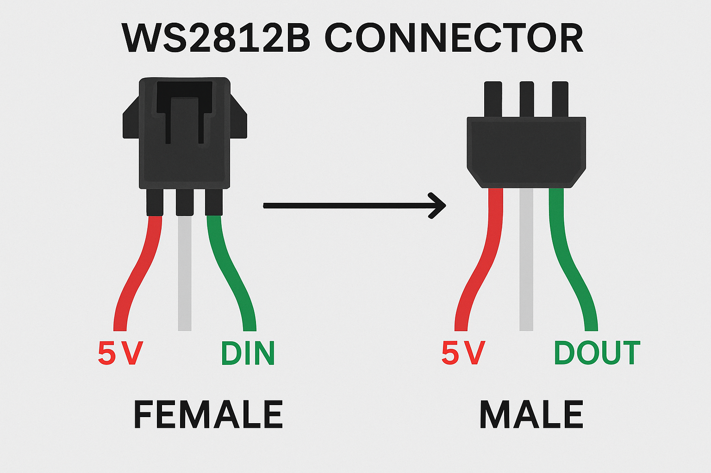
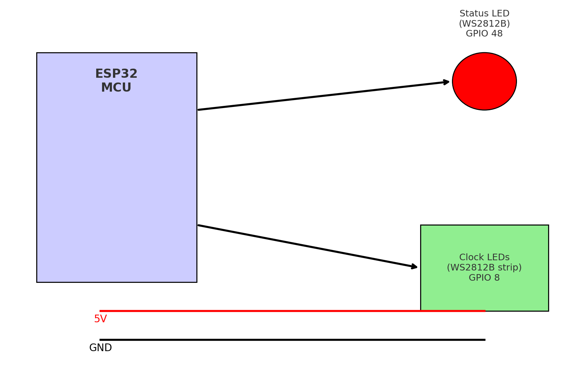

[Nederlandse versie](README.md)

# LED Clock with ESP32, FreeRTOS & WS2812B


A **DIY LED clock** built with WS2812B LEDs, an IKEA photo frame, laser‑cut parts and an **ESP32** running on **FreeRTOS**.  
The hardware (clock face, lasercut parts) is ready ✅. The software runs on a modern ESP32 + FreeRTOS platform and can be configured via a built‑in Wi‑Fi captive portal.

---

## ✨ Features

* Automatic time via **NTP** synchronization
* **Timezone detection** via IP geolocation
* **mDNS** discovery on the local network
* Wi‑Fi setup: if no connection, the clock starts an **Access Point + captive portal**
* Written in **C/C++ with FreeRTOS**
* Extendable platform: animations, integrations, artistic clockfaces
* Future **API server** + **Flutter app** for remote control

### FreeRTOS Tasks
- `task_wifi` – handle network connection and reconnection  
- `task_time` – synchronize and maintain time  
- `task_render` – render the clock on the LED strip  
- `task_portal` – run captive portal if no Wi‑Fi connection  
- `task_led` – drive the status LED  

---

## 🖥️ Software Setup

1. Install required tools:
   * [Arduino CLI](https://arduino.github.io/arduino-cli/latest/) or [Arduino IDE](https://www.arduino.cc/en/software)  
   * ESP32 board support (via Board Manager)
   * `make` (for the workflow with the Makefile)
   * [Flutter](https://flutter.dev/) (optional, for the mobile app)

2. Use the **Makefile** for a quick workflow:

   ```bash
   make deps       # install esp32 core + libs (Adafruit NeoPixel)
   make build      # compile
   make upload     # flash (PORT=/dev/ttyUSB0)
   make monitor    # open serial monitor (115200 baud)
   ```

   Variables:
   - `PORT` – default `/dev/ttyACM0`
   - `BOARD` – default `esp32:esp32:esp32s3`
   - `FLASH_OPTS` – flash/PSRAM/partition settings

   Example:
   ```bash
   make PORT=/dev/ttyUSB0 MONITOR_BAUD=115200 monitor
   ```

3. On first boot → configure Wi‑Fi via captive portal (`ESP32-Setup` / `configwifi`).

---

## ⚙️ Hardware Setup

* **Clock front** (lasercut ✅):
  

* **WS2812B connectors**:
  

* **Parts list**:
  * IKEA frame 23x23cm  
  * WS2812B LED strip or ring (5V)  
  * ESP32 devkit (WROOM/WROVER/S3)  
  * Cardboard/laser‑cut front plate  

### Connections

- **GPIO 8** → DIN of the **clock LED strip**  
- **GPIO 48** → DIN of the **status LED**  
- **5V & GND** shared between ESP32 and all LEDs

### 📷 Wiring Diagram



### 📋 Pinout Table

| GPIO | Function      | Note                                 |
|------|---------------|--------------------------------------|
| 8    | Clock LEDs DIN| Data input of WS2812B strip/matrix   |
| 48   | Status LED DIN| Data input of a single WS2812B LED   |
| 5V   | LED Power     | Ensure sufficient power supply       |
| GND  | Ground        | Must be shared with LED power supply |

### 🔌 Power Consumption (estimates)

| LEDs | 100% brightness (mA) | 100% (A) | ~30% brightness (mA) | ~30% (A) |
|-----:|----------------------:|---------:|----------------------:|---------:|
| 1    | 60                    | 0.06     | 18                    | 0.018    |
| 8    | 480                   | 0.48     | 144                   | 0.144    |
| 30   | 1800                  | 1.80     | 540                   | 0.54     |
| 60   | 3600                  | 3.60     | 1080                  | 1.08     |
| 100  | 6000                  | 6.00     | 1800                  | 1.80     |

**Tips**  
- Choose a power supply with **20–30% margin**  
- Use a **level shifter** for long LED strips  
- **GND** of LED power must be connected to ESP32 GND  
- Lower `LED_BRIGHTNESS` to save power and heat

### NeoPixel Guidelines
1. **Capacitor** – 1000µF, 6.3V+ between V+ and GND  
2. **Resistor** – 300–500Ω in the data line  
3. **Level shifter** – recommended (3.3V → 5V)  

---

## 🚀 Usage

1. Flash the firmware.  
2. On first boot: connect to **ESP32-Setup**.  
3. Open `http://192.168.4.1` and set Wi‑Fi credentials.  
4. ESP32 connects → fetches time → displays clock on LED strip (GPIO 8).  
5. Status LED (GPIO 48) shows connection state.  

---

## 📸 Images


---

## 🗺️ Roadmap

* [x] Clock front lasercut  
* [x] Wi‑Fi captive portal & NTP synchronization  
* [x] Automatic timezone detection via IP  
* [x] mDNS service  
* [ ] API server on ESP32  
* [ ] Flutter app integration  
* [ ] Artistic clockface variants  
* [ ] Animations & LED effects  
* [ ] Integration with Home Assistant / MQTT  
* [ ] Public release of PCB & 3D files  

---

## 🤝 Contributing

1. Fork the repo and create a feature branch:
   ```bash
   git checkout -b feature/new-feature
   ```
2. Commit changes with clear messages  
3. Submit a Pull Request 🚀  

Tips: document hardware/software additions, add diagrams/images, keep commits short.

---

## 👤 Author

* **Perry Couprie** – initial development  
  GitHub: [perry-amsterdam](https://github.com/perry-amsterdam)
