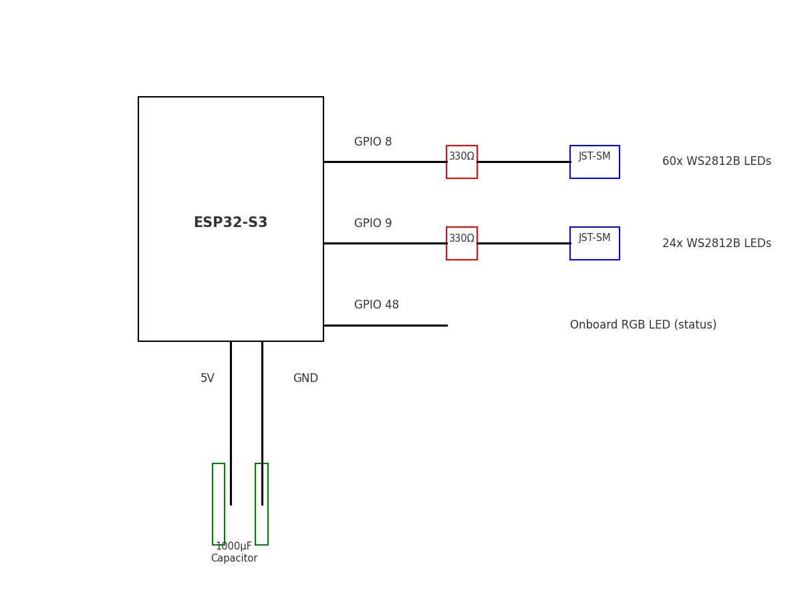

[English version](README.en.md)

# LED Clock met ESP32, FreeRTOS & WS2812B


Een **DIY LED-klok** gebouwd met WS2812B LEDs, een IKEA fotolijst, lasergesneden onderdelen en een **ESP32** die draait op **FreeRTOS**.  
De hardware (klokfront, lasercut) is klaar ✅. De software draait op een modern ESP32 + FreeRTOS platform en is volledig configureerbaar via een captive Wi-Fi portal.

---

## ✨ Features

* Automatische tijd via **NTP** synchronisatie
* **Timezone-detectie** via IP-geolocatie
* **mDNS** discovery op het lokale netwerk
* **WPS** verbindingsoptie (Wi-Fi Protected Setup)

* Wi-Fi setup: bij geen verbinding start de klok een **Access Point + captive portal**
* Geschreven in **C/C++ met FreeRTOS**
* Uitbreidbaar platform: animaties, integraties en artistieke varianten
* Toekomstige **API server** + **Flutter app** voor externe bediening

### FreeRTOS-taken
- `task_wifi` – verbinden met netwerk en reconnect  
- `task_time` – tijd synchroniseren en monitoren  
- `task_render` – klok tekenen op de LED-strip  
- `task_portal` – captive portal bij geen verbinding  
- `task_led` – status-LED bijwerken  

---

## 🖥️ Software Setup

1. Installeer de benodigde tools:
   * [Arduino CLI](https://arduino.github.io/arduino-cli/latest/) of [Arduino IDE](https://www.arduino.cc/en/software)  
   * ESP32 board support (via Board Manager)
   * `make` (voor de workflow met de Makefile)
   * [Flutter](https://flutter.dev/) (optioneel, voor de mobiele app)

2. Gebruik de **Makefile** voor een snelle workflow:

   ```bash
   make deps       # installeer esp32 core + libs (Adafruit NeoPixel)
   make build      # compileer
   make upload     # flash (PORT=/dev/ttyUSB0)
   make monitor    # seriële monitor (115200 baud)
   ```

   Variabelen:
   - `PORT` – standaard `/dev/ttyACM0`
   - `BOARD` – default `esp32:esp32:esp32s3`
   - `FLASH_OPTS` – flash/PSRAM/partition settings

   Voorbeeld:
   ```bash
   make PORT=/dev/ttyUSB0 MONITOR_BAUD=115200 monitor
   ```

3. Eerste start → configureer Wi-Fi via captive portal (`ESP32-Setup` / `configwifi`).

---

## ⚙️ Hardware Setup

* **Klokfront** (lasergesneden ✅, ontworpen in LibreCAD):  
    
  👉 Voorbeeldbestand: [clockfront-example.dxf](files/clockfront-example.dxf)
  

* **WS2812B connectors**:
  

* **Onderdelenlijst**:
  * IKEA frame 23x23cm  

  * WS2812B LED-strip of ring (5V)  
  * ESP32 devkit (WROOM/WROVER/S3)  
  * Kartonnen/lasergesneden frontplaat  

### Aansluitingen

- **GPIO 8** → DIN van de **klok-LED-strip**  
- **GPIO 48** → DIN van de **status-LED**  
- **5V & GND** gedeeld tussen ESP32 en alle LEDs

### 📷 Aansluitschema



> ℹ️ De status-LED (GPIO 48) zit al op de ESP32-S3 DevKit zelf (ingebouwde RGB LED).

### 📋 Pinout-tabel

| GPIO | Functie        | Opmerking                           |
|------|----------------|-------------------------------------|
| 8    | Klok-LEDs DIN  | Data-in van WS2812B strip/matrix    |
| 48   | Status-LED (onboard) | Ingebouwde RGB LED op ESP32 DevKit       |
| 5V   | Voeding LEDs   | Zorg voor voldoende stroomcapaciteit |
| GND  | Massa          | Moet gedeeld worden met LED-voeding |

### 🔌 Stroomverbruik (richtwaarden)

| Aantal LEDs | 100% helderheid (mA) | 100% (A) | ~30% helderheid (mA) | ~30% (A) |
|------------:|----------------------:|---------:|----------------------:|---------:|
| 1           | 60                    | 0.06     | 18                    | 0.018    |
| 8           | 480                   | 0.48     | 144                   | 0.144    |
| 30          | 1800                  | 1.80     | 540                   | 0.54     |
| 60          | 3600                  | 3.60     | 1080                  | 1.08     |
| 100         | 6000                  | 6.00     | 1800                  | 1.80     |

**Tips**  
- Kies voeding met **20–30% marge**  
- Gebruik een **level shifter** voor lange strips  
- **GND** van voeding moet verbonden zijn met ESP32  
- Zet `LED_BRIGHTNESS` lager voor minder stroom en warmte

### Richtlijnen NeoPixels
1. **Condensator** – 1000µF, 6.3V+ tussen V+ en GND  
2. **Weerstand** – 300–500Ω in de datalijn  
3. **Level shifter** – aanbevolen bij 3.3V → 5V  

---


### 📡 Wi-Fi via WPS

Naast het captive portal ondersteunt de klok ook **WPS (Wi-Fi Protected Setup)** om verbinding te maken met je netwerk.  
Dit is handig als je de Wi-Fi gegevens niet handmatig wilt invoeren.

- **WPS PBC (Push Button Configuration)**: druk op de WPS-knop van je router en start de klok in WPS-modus.  
- Als de ESP32 succesvol een WPS-handshake uitvoert, worden de netwerkgegevens automatisch opgeslagen in het NVS-geheugen van de chip.  
- Bij de volgende start gebruikt de klok deze opgeslagen gegevens direct om verbinding te maken.

⚠️ Let op: niet elke ESP32 Arduino core ondersteunt WPS.  
Vanaf **ESP32 Arduino core v3+** is `WiFi.beginWPSConfig()` verwijderd. Voor die versies moet je het captive portal gebruiken om Wi-Fi te configureren.


## 🚀 Gebruik

1. Flash de firmware.  
2. Eerste boot: verbind met **ESP32-Setup**.  
3. Open `http://192.168.4.1` en stel Wi-Fi in.  
4. ESP32 verbindt → haalt tijd op → klok op LED-strip (GPIO 8).  
5. Status-LED (GPIO 48) geeft verbindingsstatus.  

---

## 📸 Afbeeldingen


---

## 🗺️ Roadmap

* [x] Klokfront lasercutten  
* [x] Wi-Fi captive portal & NTP synchronisatie  
* [x] Automatische timezone-detectie via IP  
* [x] mDNS service  
* [x] Wifi wps
* [ ] API server op ESP32  
* [ ] Flutter app koppeling  
* [ ] Artistieke klokvarianten  
* [ ] Animaties & LED-effecten  
* [ ] Integratie met Home Assistant / MQTT  
* [ ] Public release van PCB & 3D files  

---

## 🤝 Contributing

1. Fork de repo en maak een feature branch:
   ```bash
   git checkout -b feature/nieuwe-functie
   ```
2. Commit je wijzigingen met duidelijke messages  
3. Stuur een Pull Request 🚀  

Tips: documenteer hardware/software toevoegingen, voeg schema’s of afbeeldingen toe, houd commit messages kort.

---

## 👤 Auteur

* **Perry Couprie** – initiële ontwikkeling  
  GitHub: [perry-amsterdam](https://github.com/perry-amsterdam)

---

## 📐 CAD Tools

Voor het ontwerpen van onderdelen zoals de klokfrontplaat en behuizing kun je gebruik maken van gratis open-source CAD tools:

### LibreCAD
* 2D CAD software, ideaal voor het tekenen van de **lasergesneden frontplaat**.
* Website: [https://librecad.org](https://librecad.org)

**Installatie op Ubuntu:**
```bash
sudo apt update
sudo apt install librecad
```

### OpenSCAD
* 3D CAD software, geschikt voor het ontwerpen van **behuizingen en 3D-printbare onderdelen**.
* Website: [https://openscad.org](https://openscad.org)

**Installatie op Ubuntu:**
```bash
sudo apt update
sudo apt install openscad
```

Beide programma’s zijn lichtgewicht en beschikbaar in de standaard Ubuntu repositories.
