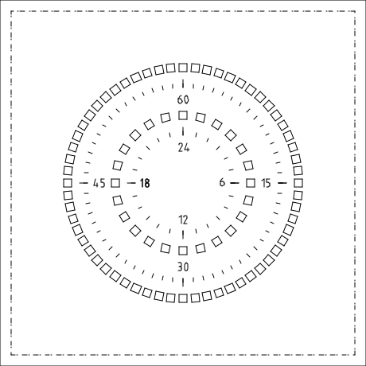
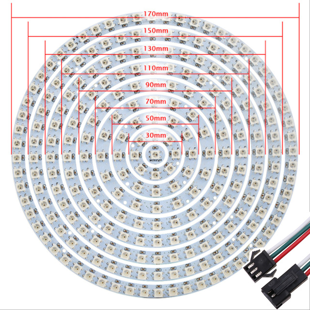

---

# LED Clock with ESP32, Zephyr & WS2812B


Een **DIY LED-klok** gebouwd met WS2812B LEDs, een IKEA fotolijst, lasergesneden onderdelen en een **ESP32** draaiend op **Zephyr RTOS**.
De eerste hardware (klokfront, lasercut) is klaar ✅. De software wordt nu volledig herbouwd op **ESP32 + Zephyr**.

---

## ✨ Features

* Internet-synchronisatie via **NTP**
* Automatische **timezone-detectie** via IP-geolocatie
* **mDNS** voor eenvoudige discovery op lokaal netwerk
* Toekomstige **API server** waarmee externe apps (zoals Flutter) de klok kunnen besturen
* **Flutter app** ontdekt de klok via mDNS en bestuurt hem via de API
* Wi-Fi setup: als er geen internetverbinding is → start de klok zelf een **Access Point + captive portal** voor configuratie
* Firmware geschreven in **Zephyr RTOS (C)**
* Platform voor uitbreidingen: animaties, slimme integraties, artistieke varianten van de klok face

---

## 🖥️ Software Setup

---

## ⚙️ Hardware Setup

* **Clock front** (lasergesneden ✅):
  

* **Onderdelenlijst**:

  * [x] [IKEA frame 23x23cm](https://www.ikea.com/nl/nl/p/sannahed-fotolijst-wit-00459116/)
  * [x] [WS2812B LED Ring (5V)](https://nl.aliexpress.com/item/32808302785.html)
  * [x] Kartonnen/lasergesneden frontplaat
  * [ ] ESP32 devkit (WROOM of WROVER)

---

## 🛠️ Tools & Software

* [LibreCAD](https://librecad.org/) – ontwerp klokplaat
* [OpenSCAD](https://www.openscad.org/) – 3D-modellen
* [KiCad EDA](https://www.kicad.org/) – PCB design (optioneel)
* [Zephyr RTOS](https://zephyrproject.org/) – firmware voor de ESP32
* [Flutter](https://flutter.dev/) – mobiele app die de klok via mDNS + API bestuurt

---

## 🔌 Belangrijke richtlijnen voor NeoPixels

1. **Capacitor** – 1000µF, 6.3V+ tussen V+ en GND
2. **Resistor** – 300–500Ω in de datalijn
3. **Level shifter** – indien MCU op 3.3V werkt (ESP32 → 5V voor WS2812B)

➡️ Dit verlengt de levensduur en voorkomt dat de eerste LED stukgaat.

---

## 📸 Afbeeldingen




---

## 🗺️ Project Roadmap

* [x] Clock front lasercutten
* [ ] ESP32 hardware integratie
* [ ] Wi-Fi captive portal & NTP synchronisatie
* [ ] Automatische timezone-detectie via IP
* [ ] mDNS service op lokaal netwerk
* [ ] API server op ESP32
* [ ] Flutter app koppelen via mDNS + API
* [ ] Clock face design uitbreiden met artistieke varianten
* [ ] Animaties en extra LED-effecten toevoegen
* [ ] Integratie met slimme thuisplatformen (Home Assistant / MQTT)
* [ ] Public release van PCB design & 3D files

---

## 🤝 Contributing

Wil je meebouwen aan dit project? Super!

* Fork de repo en maak je eigen branch:

  ```bash
  git checkout -b feature/nieuwe-functie
  ```
* Doe je aanpassingen en commit met duidelijke messages
* Stuur een Pull Request 🚀

**Tips voor bijdragen:**

* Documenteer nieuwe hardware of software duidelijk
* Voeg afbeeldingen of schema’s toe waar mogelijk
* Houd commit messages kort en informatief

---

## 👤 Auteur

* **Perry Couprie** – initiële ontwikkeling

  * GitHub: [perry-amsterdam](https://github.com/perry-amsterdam)
