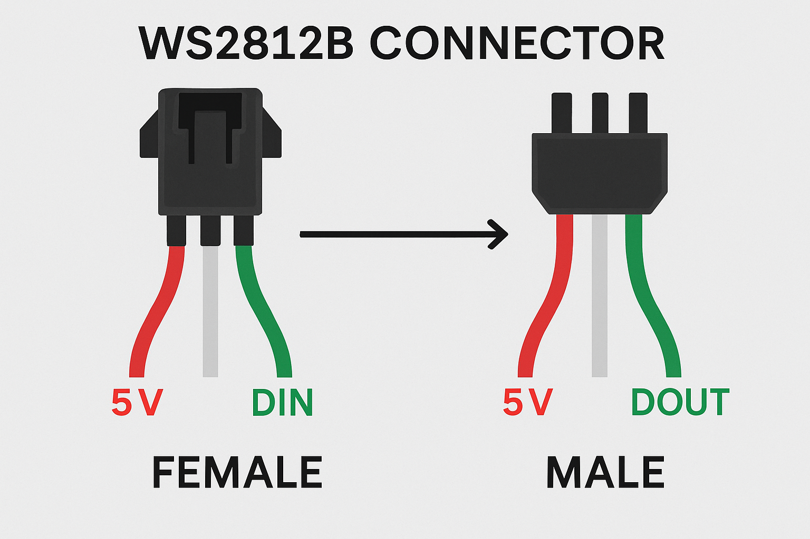

# LED Clock met ESP32, FreeRTOS & WS2812B


Een **DIY LED-klok** gebouwd met WS2812B LEDs, een IKEA fotolijst, lasergesneden onderdelen en een **ESP32** die draait op **FreeRTOS**.
De hardware (klokfront, lasercut) is klaar ✅. De software wordt nu opnieuw opgebouwd met een modern ESP32 + FreeRTOS platform.

---

## ✨ Features

* Automatische tijd via **NTP** synchronisatie
* **Timezone-detectie** via IP-geolocatie
* **mDNS** discovery op het lokale netwerk
* Toekomstige **API server** voor externe aansturing (bijv. Flutter-app)
* **Flutter app** die de klok via mDNS & API ontdekt en bedient
* Wi-Fi setup: bij geen internetverbinding start de klok zelf een **Access Point + captive portal**
* Geschreven in **C met FreeRTOS**
* Uitbreidbaar platform: animaties, slimme integraties en artistieke varianten van de klokface

---

## 🖥️ Software Setup

1. Installeer de benodigde tools:

   * [Arduino IDE](https://www.arduino.cc/en/software) of [Arduino CLI](https://arduino.github.io/arduino-cli/latest/)
   * ESP32 board support in Arduino IDE (via Board Manager)
   * [Flutter](https://flutter.dev/) (optioneel, voor de mobiele app)

2. Clone deze repository en open het project in Arduino IDE of gebruik de CLI:

   ```bash
   git clone https://github.com/<jouw-username>/<jouw-repo>.git
   cd <jouw-repo>
   arduino-cli compile --fqbn esp32:esp32:esp32
   arduino-cli upload -p /dev/ttyUSB0 --fqbn esp32:esp32:esp32
   ```

3. Configureer Wi-Fi via captive portal bij eerste start.

---

## ⚙️ Hardware Setup

* **Klokfront** (lasergesneden ✅):
  

* **WS2812B connectors**:
  

* **Onderdelenlijst**:

  * [x] [IKEA frame 23x23cm](https://www.ikea.com/nl/nl/p/sannahed-fotolijst-wit-00459116/)
  * [x] [WS2812B LED Ring (5V)](https://nl.aliexpress.com/item/32808302785.html)
  * [x] Kartonnen/lasergesneden frontplaat
  * [x ] ESP32 devkit (WROOM of WROVER)

---

## 🛠️ Tools & Software

* [Arduino IDE](https://www.arduino.cc/en/software) – firmware ontwikkeling & uploaden
* [Arduino CLI](https://arduino.github.io/arduino-cli/latest/) – command-line workflow
* [LibreCAD](https://librecad.org/) – ontwerp klokplaat
* [OpenSCAD](https://www.openscad.org/) – 3D-modellen
* [KiCad EDA](https://www.kicad.org/) – PCB design (optioneel)
* [Flutter](https://flutter.dev/) – mobiele app die de klok via mDNS & API bestuurt

---

## 🔌 Belangrijke richtlijnen voor NeoPixels

1. **Capacitor** – 1000µF, 6.3V+ tussen V+ en GND
2. **Resistor** – 300–500Ω in de datalijn
3. **Level shifter** – nodig bij 3.3V MCU’s (ESP32) → 5V voor WS2812B

➡️ Dit verlengt de levensduur en voorkomt dat de eerste LED stukgaat.

---

## 📸 Afbeeldingen


---

## 🗺️ Roadmap

* [x] Klokfront lasercutten
* [ ] ESP32 hardware integratie
* [x] Wi-Fi captive portal & NTP synchronisatie
* [x] Automatische timezone-detectie via IP
* [x] mDNS service op lokaal netwerk
* [ ] API server op ESP32
* [ ] Flutter app koppelen via mDNS + API
* [ ] Artistieke varianten van de klokface
* [ ] Animaties & LED-effecten
* [ ] Integratie met slimme thuisplatformen (Home Assistant / MQTT)
* [ ] Public release van PCB design & 3D files

---

## 🤝 Contributing

Wil je bijdragen? Top!

1. Fork de repo en maak een feature branch:

   ```bash
   git checkout -b feature/nieuwe-functie
   ```
2. Commit je wijzigingen met duidelijke messages
3. Stuur een Pull Request 🚀

**Tips:**

* Documenteer hardware/software toevoegingen
* Voeg schema’s of afbeeldingen toe waar mogelijk
* Houd commit messages kort en informatief

---

## 👤 Auteur

* **Perry Couprie** – initiële ontwikkeling

  * GitHub: [perry-amsterdam](https://github.com/perry-amsterdam)

